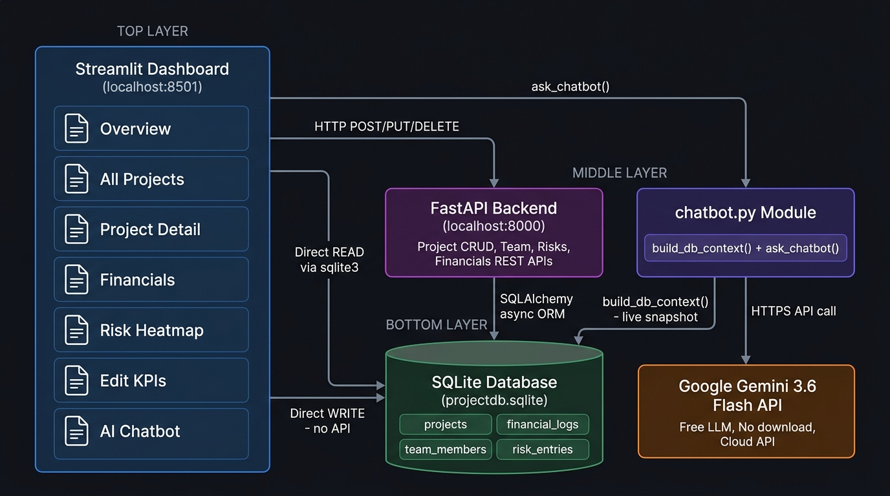
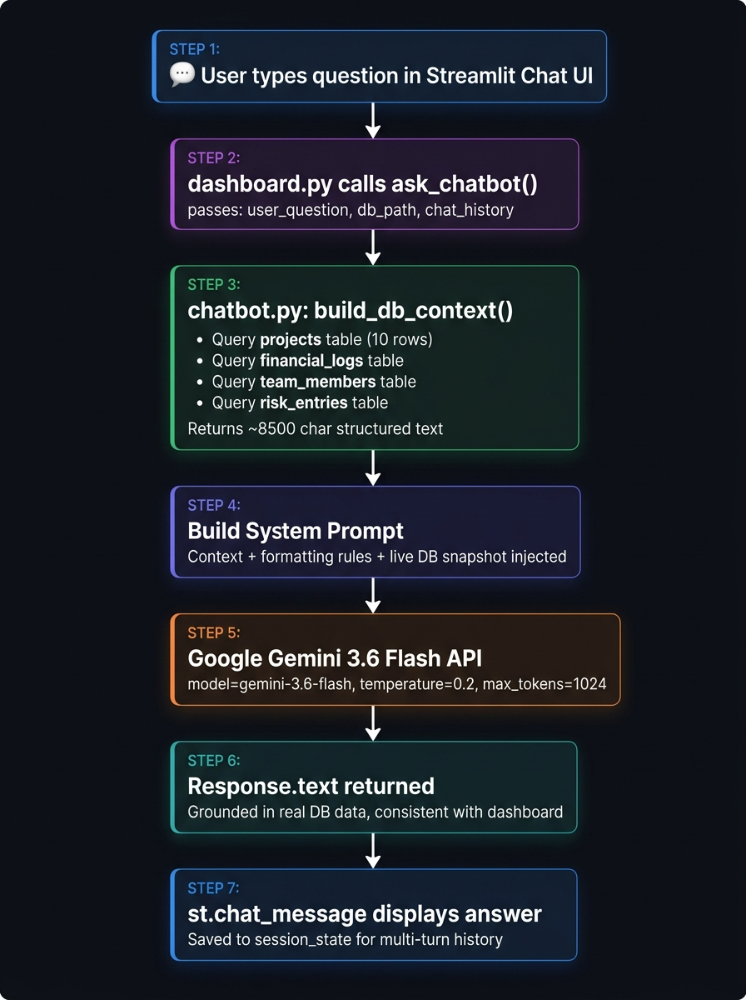

# Project Tracker — Technical Documentation

> **Application:** Project Management Dashboard with GenAI Chatbot  
> **Stack:** Python · FastAPI · SQLite · Streamlit · Google Gemini  
> **Repository:** https://github.com/arunsabharwal1/arun-practise  
> **Local URL:** http://localhost:8501

---

## System Architecture



---

## Part 1 — How the Application Was Built (Step by Step)

### Phase 1: Backend API (FastAPI + SQLite)

The foundation of the application is a **REST API** built with FastAPI. It manages all project data and exposes endpoints for create, read, update, and delete operations.

#### Step 1 — Project scaffolding
The project was initialized with a clean Python virtual environment:
```bash
python3 -m venv .venv
source .venv/bin/activate
pip install fastapi uvicorn sqlalchemy aiosqlite pydantic python-dotenv
```

#### Step 2 — Database models (`app/models.py`)
Four SQLAlchemy ORM models were created to represent the core entities:

| Table | Columns |
|-------|---------|
| `projects` | id, name, description, client, status, start_date, end_date |
| `financial_logs` | id, project_id, budget, actual_cost, revenue, notes |
| `team_members` | id, project_id, name, role, email, allocation_percentage, is_lead |
| `risk_entries` | id, project_id, title, probability, impact, status, mitigation_plan, owner |

Relationships used `CASCADE DELETE` — deleting a project removes all related financials, team, and risks automatically.

#### Step 3 — Pydantic schemas (`app/schemas.py`)
Request and response schemas were defined using **Pydantic v2** for automatic data validation. Computed fields like `profit_margin` and `budget_utilization` are returned in responses but not stored raw in the DB — they are calculated at query time.

#### Step 4 — CRUD functions (`app/crud.py`)
Pure async functions were written for every database operation. These functions are cleanly separated from the HTTP layer, making them callable by AI agents directly without going through HTTP.

#### Step 5 — API routers (`app/routers/`)
Four routers handle the REST endpoints:
- `projects.py` → `/projects` (CRUD)
- `financials.py` → `/projects/{id}/financials`
- `teams.py` → `/projects/{id}/team`
- `risks.py` → `/projects/{id}/risks`

#### Step 6 — Risk Matrix logic
A probability × impact matrix was implemented to auto-compute risk levels:

| Probability ↓ / Impact → | Low | Medium | High | Critical |
|---|---|---|---|---|
| **Low** | low | low | medium | medium |
| **Medium** | low | medium | high | critical |
| **High** | medium | high | critical | critical |
| **Critical** | medium | high | critical | critical |

#### Step 7 — Database seeding (`seed_data.py`)
10 sample projects were seeded with realistic financial data, team members, and risk entries so the dashboard had meaningful data from day one:
```bash
python seed_data.py
```

---

### Phase 2: Streamlit Dashboard (`dashboard.py`)

The dashboard is a **single-file Streamlit application** that reads directly from SQLite for display and calls FastAPI for writes.

#### Step 8 — Custom dark-mode CSS
A comprehensive dark theme was applied using inline `st.markdown()` CSS:
- Background: `#0f1117`
- Sidebar gradient: `#1a1f2e → #16213e`
- Status badges with colour-coded borders (green=active, blue=planning, amber=on_hold, etc.)
- Risk badges mapped to severity colours

#### Step 9 — Cached DB helpers
Four cached loader functions were written with a 5-second TTL:
```python
@st.cache_data(ttl=5)
def load_projects(): ...
def load_financials(): ...
def load_team(): ...
def load_risks(): ...
```
This ensures the dashboard is fast but always shows data that is at most 5 seconds stale.

#### Step 10 — Dashboard pages built

| Page | What it shows |
|------|--------------|
| 🏠 Overview | 6 KPI metric cards + 5 Plotly charts |
| 📁 All Projects | Searchable, filterable project list with financials |
| 🔍 Project Detail | Per-project tabs: Financials, Team, Risks, Edit |
| 💰 Financials | Summary table + portfolio waterfall chart |
| ⚠️ Risk Heatmap | Interactive heatmap + stacked risk-by-project chart |
| ➕ Add Project | Form to create new projects with optional financials and lead |

#### Step 11 — Plotly charts integrated
All charts use Plotly with transparent backgrounds (`paper_bgcolor="rgba(0,0,0,0)"`) to blend into the dark Streamlit theme:
- Donut chart (project status distribution)
- Grouped bar chart (budget vs cost vs revenue)
- Horizontal bar chart (profit margin per project)
- Gauge chart (budget utilization)
- Heatmap (risk matrix)

---

## Part 2 — How the Chatbot Was Created (Step by Step)

### Step 1 — LLM API selection

Three options were evaluated:

| Option | Download? | Free? | Context Window | Chosen? |
|--------|-----------|-------|----------------|---------|
| Google Gemini | ❌ No | ✅ Yes | 1M tokens | ✅ **Yes** |
| OpenAI GPT | ❌ No | Paid | 128K | ❌ |
| Hugging Face | ❌ No | ✅ Yes | Varies | ❌ |

**Gemini 3.6 Flash** was chosen: free tier, no download, large context window to fit the full DB snapshot.

### Step 2 — Install the SDK
```bash
pip install google-genai>=1.0.0
```
> Note: Google deprecated `google-generativeai` — the new package is `google-genai`.

### Step 3 — Get a free API key
1. Go to https://aistudio.google.com/app/apikey
2. Sign in with Google
3. Click **"Create API key"**
4. Copy the key → paste into `.env`:
   ```
   GEMINI_API_KEY=AIzaSy...your-key
   ```

### Step 4 — Build `chatbot.py`

The chatbot was built as a **standalone module** (separate from `dashboard.py`) with two core functions:

#### `build_db_context(db_path)` — The Data Bridge

This function queries all 4 tables and serializes the data into structured text the LLM can reason over:

```python
def build_db_context(db_path="projectdb.sqlite") -> str:
    # Queries: projects, financial_logs, team_members, risk_entries
    # Formats numbers to match dashboard exactly ($1.2M, 56.8%, etc.)
    # Returns ~8,500 character structured text block
```

Sample output snippet:
```
=== PROJECT TRACKER - LIVE DATABASE SNAPSHOT ===
Total Projects  : 10
Total Budget    : $6.28M
Total Revenue   : $7.14M
Portfolio Margin: 61.4%

[Project #1] ERP System Migration
  Client      : Apex Manufacturing Ltd
  Status      : ACTIVE
  Budget      : $850.0K
  Profit Mrgn : 56.8%
  ...
```

#### `ask_chatbot(user_question, db_path, chat_history)` — The LLM Caller

```python
def ask_chatbot(user_question, db_path, chat_history=None) -> str:
    # 1. Validate API key
    # 2. Call build_db_context() for fresh data
    # 3. Build system prompt with context injected
    # 4. Reconstruct conversation history in Gemini format
    # 5. Call Gemini API (temperature=0.2 for factual answers)
    # 6. Return response.text
```

Key design decisions:
- **temperature=0.2** — keeps answers factual, reduces hallucination
- **max_output_tokens=1024** — concise answers
- **System prompt** instructs the model to only use provided data, never invent numbers
- **Conversation history** passed on every call → multi-turn dialogue works

### Step 5 — Chatbot data flow



### Step 6 — Model version troubleshooting

During setup, two deprecated models were encountered:

| Model tried | Error | Resolution |
|---|---|---|
| `gemini-2.0-flash` | 404 — no longer available | Updated to `gemini-2.5-flash` |
| `gemini-2.5-flash` | 404 — unavailable to new users | Listed all available models via API, chose `gemini-3.6-flash` |

**How models were listed:**
```python
client = genai.Client(api_key=key)
for m in client.models.list():
    print(m.name)  # confirmed gemini-3.6-flash is available
```

---

## Part 3 — Integration Between App and Chatbot

### Integration Architecture

```
┌─────────────────────────────────────────────────┐
│              Streamlit Dashboard                 │
│                  dashboard.py                    │
│                                                  │
│  ┌──────────────┐    ┌────────────────────────┐ │
│  │ Edit KPIs    │    │   AI Chatbot Page      │ │
│  │ page         │    │                        │ │
│  │              │    │  st.chat_input()       │ │
│  │ st.data_     │    │  st.chat_message()     │ │
│  │ editor()     │    │  ask_chatbot()  ───────┼─┼──► chatbot.py
│  │              │    │                        │ │         │
│  └──────┬───────┘    └────────────────────────┘ │         │
│         │ Direct WRITE                           │         │ build_db_context()
│         │ (no FastAPI)                           │         │         │
└─────────┼───────────────────────────────────────┘         │         │
          │                                                  │         │
          ▼                                                  ▼         ▼
    ┌─────────────────────────────────────────────────────────────────┐
    │                   SQLite Database                               │
    │                   projectdb.sqlite                              │
    │                                                                 │
    │   projects  │  financial_logs  │  team_members  │  risk_entries │
    └─────────────────────────────────────────────────────────────────┘
                                                              │
                                                              ▼
                                                   Google Gemini 3.6 Flash
                                                   (free API, cloud)
```

### How data consistency is guaranteed

The key design principle is that **the chatbot always reads the same source of truth as the dashboard**:

1. Dashboard **displays** data from SQLite (via `@st.cache_data` loaders)
2. Chatbot **reads** data from SQLite (via `build_db_context()` — no cache)
3. Edit KPIs page **writes** data directly to SQLite

This means:
- If you change a budget in **Edit KPIs** → SQLite is updated
- Next chatbot question → `build_db_context()` queries SQLite fresh → Gemini sees the new number
- Dashboard refreshes (cache cleared on save) → shows the same new number

**No data ever diverges.**

### Edit KPIs → Chatbot update cycle

```
User edits Budget in ✏️ Edit KPIs
         │
         ▼
db_update_financials(project_id, budget, cost, revenue)
         │  (direct sqlite3 UPDATE — no FastAPI required)
         ▼
SQLite financial_logs table updated
         │
         ├──► st.cache_data.clear() + st.rerun()
         │         Dashboard charts refresh immediately
         │
         └──► Next chatbot question:
               build_db_context() → fresh SQLite query
               → Gemini sees updated numbers
               → Answer reflects the change ✅
```

### Files and their roles

| File | Role | Reads DB? | Writes DB? |
|------|------|-----------|------------|
| `app/main.py` | FastAPI entry point | Via ORM | Via ORM |
| `app/crud.py` | Async DB operations | ✅ | ✅ |
| `app/models.py` | SQLAlchemy table models | — | — |
| `app/schemas.py` | Pydantic request/response models | — | — |
| `dashboard.py` | Streamlit UI + page logic | ✅ Direct sqlite3 | ✅ Via FastAPI OR direct sqlite3 |
| `chatbot.py` | Gemini chatbot module | ✅ Direct sqlite3 (fresh, no cache) | ❌ |
| `seed_data.py` | One-time data seeder | ❌ | ✅ |
| `projectdb.sqlite` | The database | — | — |

### API key security

| File | Committed to Git? | Contains API key? |
|------|-------------------|-------------------|
| `.env` | ❌ No (in `.gitignore`) | ✅ Real key |
| `.env.example` | ✅ Yes | ❌ Placeholder only |

---

## Running the Full Application

```bash
# 1. Clone
git clone https://github.com/arunsabharwal1/arun-practise.git
cd arun-practise

# 2. Virtual environment
python3 -m venv .venv
source .venv/bin/activate

# 3. Install dependencies
pip install -r requirements.txt

# 4. Configure environment
cp .env.example .env
# Add your GEMINI_API_KEY to .env

# 5. Seed database (first time only)
python seed_data.py

# 6. Start FastAPI backend (optional — needed for project writes)
uvicorn app.main:app --reload
# Runs at http://localhost:8000

# 7. Start Streamlit dashboard
streamlit run dashboard.py
# Runs at http://localhost:8501
```

---

## Tech Stack Summary

| Component | Technology | Version |
|-----------|-----------|---------|
| Dashboard UI | Streamlit | 1.63.0 |
| Charts | Plotly | 7.0.0 |
| Data processing | Pandas | 3.0.5 |
| REST API | FastAPI | 0.115.0 |
| API server | Uvicorn | 0.30.6 |
| ORM | SQLAlchemy | 2.0.35 |
| Async DB driver | aiosqlite | 0.20.0 |
| Data validation | Pydantic v2 | 2.9.2 |
| AI SDK | google-genai | 2.22.0 |
| LLM | Gemini 3.6 Flash | Free tier |
| Database | SQLite | Built-in |
| Environment | python-dotenv | 1.0.1 |
